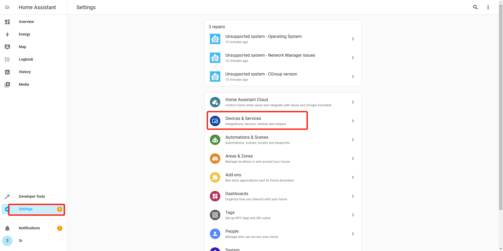

<p align="center">
  <a href="#build-framework">
  
  </a><br>
  <strong>Armbian Linux Build Framework</strong><br>
<br>
<a href=https://github.com/armbian/build/actions/workflows/build-train.yml></a>
<a href=https://github.com/armbian/build/actions/workflows/build-all-desktops.yml></a>
<a href=https://github.com/armbian/build/actions/workflows/smoke-tests.yml></a>
 <br>

<br>
<a href=https://twitter.com/armbian></a>
<a href=http://discord.armbian.com/></a>
<a href=https://liberapay.com/armbian></a>
</p>


## Table of contents

- [Compile firmware](#compile-firmware)
- [Flash firmware](#flash-firmware)
- [Configuring HA](#configuring-ha)

## Compile firmware

### Download

```bash
git clone git@github.com:thirdreality/HA-Box.git
```

### Compile

Run in the root directory of Armbian.

```bash
./compile.sh BOARD=jethubj100 BRANCH=current RELEASE=jammy BUILD_MINIMAL=no BUILD_DESKTOP=no KERNEL_ONLY=no KERNEL_CONFIGURE=no COMPRESS_OUTPUTIMAGE=sha,gpg,img
```

The compiled generated firmware is located: `output/images/Armbian_22.11.0-trunk_Jethubj100_jammy_current_5.10.166.img`

(This firmware is not yet available for burning.)

### Firmware

Unzip `Armbian_convert.zip` 

[Armbian_Convert.zip](https://github.com/thirdreality/HA-Box/releases/download/Assets/Armbian_Convert.zip)

Copy `Armbian_22.11.0-trunk_Jethubj100_jammy_current_5.10.166.img` to `Armbian_Convert`.

```bash
cp HA-Box/output/images/Armbian_22.11.0-trunk_Jethubj100_jammy_current_5.10.166.img Armbian_Convert/
```

(If the compiled firmware is not `xxx.166.img`, you need to change to the appropriate name in `Armbian_Convert/build.sh`.)

Add executable permissions to first, then run `./build.sh`.

```bash
cd Armbian_Convert
chmod +x *
chmod +x tools/*
./build.sh
```

The generated firmware is located: `output/Armbian_22.11.0-trunk_Jethubj100_jammy_current_5.10.166.burn.img` 


## Flash firmware

To prepare the burning environment on the computer:
1. Download and extract the file [Aml_Burn_Tool.zip](https://github.com/thirdreality/HA-Box/releases/download/Assets/Aml_Burn_Tool.zip).
2. If this is your first time using the tool, click on `Setup_Aml_Burn_Tool_V3.1.0.exe` to install necessary drivers.
3. Next, navigate to the `v3` folder and run `Aml_Burn_Tool.exe`.
4. Load the compiled `**.img` firmware file.
5. Click on `Start` to initiate the burn process.
6. Press and hold the button circled in the image below, then connect the black line to your computer and start flashing. You can release the button when you start flashing.

<a href="#flash-box"></a>


## Configuring HA

### Serial debug
Connect both cables to your computer as shown in the image below.
You will see the logging info from the PC terminal. (baud rate is: 115200)

<a href="#config-serial-debug-box"></a>

### Create a root user

* Create and verify root password
* Choose default system command shell: choose 1) bash
* We don't need to create regular users. Press `Ctrl-C` to abort

<a href="#config-create-root-user"></a>


### Configure WiFi

Modify `/etc/wpa_supplicant/wpa_supplicant-nl80211-wlan0.conf` as follows.
```
network={
    ssid="<SSID>"
    psk="<PWD>"
}
```
reboot

### Configure Zigbee

Flash zigbee firmware.

```bash
/usr/lib/firmware/bl706/bl706_func.sh flash
```
The first flash takes a long time because some dependencies need to be installed.

Add self-start.

```bash
systemctl enable bl706.service
systemctl start bl706.service
```

### Install HA

Install necessary tools.

```bash
sudo apt update
sudo apt install udisks2 systemd-journal-remote -y
```

Install docker.

```bash
curl -fsSL get.docker.com | sh
```

Install OS Agent.

```bash
wget https://github.com/home-assistant/os-agent/releases/download/1.5.1/os-agent_1.5.1_linux_aarch64.deb  (View the latest installation package：https://github.com/home-assistant/os-agent/releases/latest)
dpkg -i os-agent_1.5.1_linux_aarch64.deb
```

Install Home Assistant. 
(When homeassistant-supervised.deb is installed, NetworkManager will start so that the network cannot be connected. Therefore, we need to modify homeassistant-supervise.deb.)
```bash
wget https://github.com/home-assistant/supervised-installer/releases/download/1.4.3/homeassistant-supervised.deb
dpkg-deb -R homeassistant-supervised.deb homeassistant-supervised
```

Modify `homeassistant-supervised/DEBIAN/postinst` and comment out the following.
```bash
# Restart NetworkManager
#info "Restarting NetworkManager"
#systemctl restart "${SERVICE_NM}"
```

Repackage homeassistant-supervise.deb.
```bash
dpkg-deb -b homeassistant-supervised homeassistant-supervised.deb
```

Install homeassistant-supervised.

```bash
BYPASS_OS_CHECK=true dpkg -i homeassistant-supervised.deb
```

Machine type. Choose `raspberrypi4-64`.

<a href="#install-ha-choose-raspberrypi4"></a>

After the installation is complete, the following screen is displayed.

<a href="#install-ha-complete"></a>

### Configure HA

Wait about 20 minutes, then type `http://10.1.0.97:8123` into your browser.

Click `Settings -> Devices & Services`.

<a href="#ha-devices-services."></a>

Click `ADD INTEGRATION`.

<a href="#ha-add-integration"></a>

Choose `Zigbee Home Automation`

<a href="#ha-choose-zha"></a>

Choose `ZiGate`

<a href="#ha-zha-zigate"></a>

Input `/dev/ttyAML3`

<a href="#ha-zha-serial-port"></a>

Choose Create a network

<a href="#ha-zha-create_network"></a>

